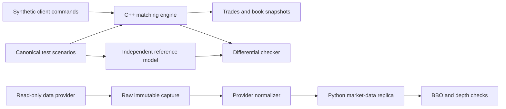

# Limit Order Book Development Plan

This is the shared, checked-in tracker for the project.

The target is a **three-week MVP**, assuming both contributors can spend roughly
6–10 focused hours per week. Week 4 is optional and covers a live read-only
market-data demo plus benchmarks.

## How to use this tracker

- Change `[ ]` to `[x]` when a task is complete.
- Update checkboxes through a branch and pull request so both contributors see
  the same state.
- Put the pull request or issue number beside completed work when useful.
- Do not mark a milestone complete until its exit gate passes.
- If a task grows beyond one reviewable pull request, split it here first.

Owners:

- **Albert** — production C++ matching engine
- **Brian** — independent test framework and read-only market-data pipeline
- **Both** — contracts, semantics, reviews, and milestone acceptance

## Current status

- [ ] Milestone 0: Shared contracts and scaffolding
- [ ] Milestone 1: Resting book and reference model
- [ ] Milestone 2: Matching, cancellation, and differential tests
- [ ] Milestone 3: Time-in-force and hardening
- [ ] Optional Milestone 4: Real-world market-data replay
- [ ] Optional Milestone 5: Benchmarks and final demonstration

## Architecture boundary

The matching engine and market-data replica are related but different systems:

- The **matching engine** accepts client orders and decides which trades occur.
- The **market-data replica** consumes updates produced by an external venue
  and reconstructs that venue's visible book.

External quotes must not be submitted to the matching engine as fake customer
orders. Provider-specific code must not appear in the engine's public API.

## Ownership boundaries

### Albert: production implementation

- [ ] Own `include/lob/types.hpp`.
- [ ] Own `include/lob/order_book.hpp`.
- [ ] Own `src/order_book.cpp`.
- [ ] Implement integer ticks and quantities.
- [ ] Implement price-time matching at the resting order's price.
- [ ] Implement active cancellation.
- [ ] Implement GTC, IOC, Market, and FOK behavior.
- [ ] Add implementation-local unit tests with each production change.
- [ ] Add benchmarks only after all correctness gates pass.

### Brian: independent verification

- [ ] Own `tests/reference_book.*`.
- [ ] Own `tests/scenarios/`.
- [ ] Own randomized and differential test infrastructure.
- [ ] Own sanitizer and CI integration.
- [ ] Keep the reference model deliberately simple.
- [ ] Do not reuse production matching functions or private containers.
- [ ] Persist failing random seeds so failures are reproducible.

### Brian: market-data integration

- [ ] Own `tools/market_data/`.
- [ ] Capture raw responses or streams without modification.
- [ ] Normalize provider data into versioned JSONL fixtures.
- [ ] Build a separate read-only replica in Python.
- [ ] Validate ordering, best bid/ask, and aggregate depth.
- [ ] Keep normal CI offline and deterministic.

### Both: shared decisions

- [ ] Approve the public order-book API before parallel implementation.
- [ ] Approve event and rejection semantics.
- [ ] Approve synthetic-command and market-data schemas.
- [ ] Review every public-header change.
- [ ] Review each other's pull requests.
- [ ] Agree that each milestone's exit gate has passed.

## Milestone 0: Shared contracts and scaffolding

**Target:** 1–2 focused sessions

**Suggested branch:** `contract/scaffold`

### Repository setup

- [ ] **Both:** Add the CMake project.
- [ ] **Both:** Create `lob` and `lob_tests` targets.
- [ ] **Both:** Require C++20.
- [x] **Brian:** Enable warnings-as-errors in CI ([PR #3](https://github.com/al97/limit_order_book/pull/3)).
- [x] **Brian:** Add AddressSanitizer and UndefinedBehaviorSanitizer jobs ([PR #3](https://github.com/al97/limit_order_book/pull/3)).
- [x] **Both:** Document one-command local build and test instructions ([PR #4](https://github.com/al97/limit_order_book/pull/4)).

### Public contract

- [ ] **Albert:** Define `OrderId`, `Price`, `Quantity`, and `Sequence` as
      integer types.
- [ ] **Albert:** Define `Side`, `TimeInForce`, `EventType`, and
      `RejectReason`.
- [ ] **Both:** Agree on the `NewOrder` shape.
- [ ] **Both:** Agree on the `Event` shape and event ordering.
- [ ] **Both:** Agree on `submit`, `cancel`, `top`, `depth`, and
      `resting_quantity`.
- [ ] **Both:** Keep all containers private.

### Locked behavior

- [ ] Duplicate order ID rejects without mutation.
- [ ] Zero quantity rejects without mutation.
- [ ] Unknown or already-filled cancellation returns `UnknownOrder`.
- [ ] Trades occur at the resting maker's price.
- [ ] A Market order never rests.
- [ ] An insufficient FOK order creates no trades and no mutation.
- [ ] Engine sequence, not wall-clock time, determines FIFO order.

### Shared golden scenarios

- [ ] **Both:** Non-crossing GTC order rests.
- [ ] **Both:** Buy 101 crosses resting sell 100 and trades at 100.
- [ ] **Both:** Two orders at one price fill FIFO with a partial second fill.

### Exit gate

- [ ] Both contributors can build the same checkout.
- [ ] Public headers compile.
- [ ] The three golden scenarios have agreed expected events and final states.
- [ ] No production matching logic is required yet.

## Milestone 1: Resting book and reference model

**Target:** Week 1

Work in parallel after Milestone 0 merges.

**Suggested branches:**

- `engine/resting-book`
- `test/reference-model`

### Albert: resting production book

- [ ] Add descending ordered bid levels.
- [ ] Add ascending ordered ask levels.
- [ ] Add FIFO orders inside each price level.
- [ ] Cache total remaining quantity per level.
- [ ] Add the order-ID-to-locator index.
- [ ] Implement non-crossing GTC insertion.
- [ ] Implement top-of-book queries.
- [ ] Implement depth queries.
- [ ] Implement resting-quantity lookup.
- [ ] Add unit tests for both sides and multiple prices.

### Brian: reference model and harness

- [ ] Implement a slow reference book optimized for clarity.
- [ ] Keep reference state independent from production internals.
- [ ] Build helpers to compare observable snapshots.
- [ ] Add malformed-command and rejection scenarios.
- [ ] Add invariant checks for level totals and live IDs.
- [ ] Make test failures print the full command history.

### Exit gate

- [ ] Production and reference books agree on all non-crossing scenarios.
- [ ] Bids are returned highest first.
- [ ] Asks are returned lowest first.
- [ ] Level totals equal the sum of resting orders.
- [ ] Every live order has exactly one ID-index entry.

## Milestone 2: Matching, cancellation, and differential tests

**Target:** Week 2

**Suggested branches:**

- `engine/matching-cancel`
- `test/differential`

### Albert: matching

- [ ] Implement incoming-buy matching against the cheapest asks.
- [ ] Implement incoming-sell matching against the highest bids.
- [ ] Execute at the resting order's price.
- [ ] Handle complete maker fills.
- [ ] Handle partial maker fills without losing FIFO position.
- [ ] Rest a GTC taker's unfilled remainder.
- [ ] Sweep multiple acceptable price levels.
- [ ] Stop before the next unacceptable price.
- [ ] Remove empty levels and stale ID entries.

### Albert: active cancellation

- [ ] Cancel a live order through its ID locator.
- [ ] Update the price-level total.
- [ ] Remove the order from its FIFO.
- [ ] Remove the ID-index entry.
- [ ] Remove the price level when its final order is cancelled.
- [ ] Test cancellation at the head, middle, and tail.

### Brian: differential verification

- [ ] Assert exact event ordering, not only final BBO.
- [ ] Generate deterministic add/cancel command streams.
- [ ] Run each stream against production and reference books.
- [ ] Compare trades, rejections, depth, BBO, and live-order quantities.
- [ ] Save any failing seed and minimized command sequence.
- [ ] Run both buy- and sell-heavy distributions.

### Exit gate

- [ ] All worked examples in the explanatory docs pass.
- [ ] Production and reference results agree for deterministic random seeds.
- [ ] No crossed or locked book survives a command.
- [ ] Cancellation never changes the relative order of surviving orders.
- [ ] Sanitizer jobs pass.

## Milestone 3: Time-in-force and hardening

**Target:** Week 3

**Suggested branches:**

- `engine/time-in-force`
- `test/fuzz-hardening`

### Albert: remaining order behavior

- [ ] Implement IOC: match available quantity and cancel the remainder.
- [ ] Implement Market: ignore a price cap and never rest.
- [ ] Implement an FOK read-only liquidity pre-check.
- [ ] Prevent overflow during the FOK quantity check.
- [ ] Confirm insufficient FOK cannot emit a partial trade.

### Brian: hardening

- [ ] Add no-mutation assertions for all rejected commands.
- [ ] Add empty-book and one-sided-book scenarios.
- [ ] Add maximum-value boundary scenarios.
- [ ] Expand randomized testing across all time-in-force values.
- [ ] Add a debug invariant checker invocation after every generated command.
- [ ] Run the test suite repeatedly under ASAN and UBSAN.
- [ ] Document how to reproduce every randomized failure.

### Both: MVP documentation

- [ ] Update the README with the architecture and build commands.
- [ ] Add one complete submit/match/cancel example.
- [ ] State clearly that the project is a learning engine, not a production
      exchange.
- [ ] Document unsupported behavior.

### MVP exit gate

- [ ] GTC, IOC, Market, FOK, and cancellation have golden tests.
- [ ] Random differential tests pass with fixed seeds.
- [ ] All invariants hold after every command.
- [ ] ASAN and UBSAN pass.
- [ ] A fresh clone builds and tests with one documented command.
- [ ] Each contributor has reviewed the other's work.

At this point, the core project is complete enough to discuss in interviews.

## Optional Milestone 4: Real-world market-data replay

**Target:** Week 4 or later

**Suggested branch:** `integration/market-data-replay`

Start with one documented read-only source:

- Nasdaq ITCH sample data for order-level equity events,
- Databento MBO if available, or
- a public crypto L2 stream for an easier live demonstration.

Robinhood's official developer trading API is crypto-specific. Do not use
reverse-engineered Robinhood equities endpoints.

### Capture

- [ ] **Brian:** Choose and document the provider and data granularity.
- [ ] **Brian:** Record a small raw fixture without modification.
- [ ] **Brian:** Record provider sequence numbers and timestamps.
- [ ] **Brian:** Remove credentials and account information.
- [ ] **Both:** Confirm the fixture license permits committing it.

### Normalize

- [ ] Version the normalized schema.
- [ ] Parse decimal prices into exact integer ticks.
- [ ] Preserve the distinction between snapshots and incremental updates.
- [ ] Preserve L2 versus L3 semantics.
- [ ] Do not invent order IDs or FIFO position from aggregate L2 data.
- [ ] Reject or flag sequence gaps.

### Replica

- [ ] Build the Python read-only replica.
- [ ] Apply a snapshot before incremental updates when the provider requires it.
- [ ] Reproduce best bid, best ask, spread, and depth.
- [ ] Replay a recorded session to the same final state every time.
- [ ] Keep normal CI completely offline.
- [ ] Add a separate opt-in public-data smoke test.

### Exit gate

- [ ] Offline replay is deterministic.
- [ ] A sequence gap is detected rather than silently ignored.
- [ ] Provider code has no dependency on production matcher internals.
- [ ] Documentation clearly distinguishes the replica from the matcher.

## Optional Milestone 5: Benchmarks and demonstration

**Suggested branch:** `bench/demo`

- [ ] Benchmark a non-crossing resting insert.
- [ ] Benchmark cancellation of a random live order.
- [ ] Benchmark takers that fill 1, 10, and 100 makers.
- [ ] Report latency distributions, not only averages.
- [ ] Record compiler, build mode, CPU, and fixture sizes.
- [ ] Profile before changing containers.
- [ ] Keep the correctness-first implementation as a reference.
- [ ] Demonstrate synthetic command replay through the matcher.
- [ ] Demonstrate real market-data replay through the replica.
- [ ] Explain why these are separate data flows.

## Pull-request checklist

Copy this section into each pull request:

- [ ] The change has one clear owner and scope.
- [ ] Public behavior changes are documented.
- [ ] New behavior has tests.
- [ ] Tests use public events and snapshots, not private containers.
- [ ] No credentials, account data, or private raw responses are included.
- [ ] Formatter, compiler warnings, tests, and sanitizers pass.
- [ ] The other contributor reviewed the change.
- [ ] Relevant tasks in this tracker are updated in the same PR.

## Working agreements

- [ ] Protect `main`; merge through reviewed pull requests.
- [ ] Prefer small branches that live for days, not weeks.
- [ ] Rebase or merge `main` before requesting final review.
- [ ] Resolve API disagreements in the shared contract before implementing both
      interpretations.
- [ ] Production code and the reference model must not share matching logic.
- [ ] External network calls are opt-in and never required by normal CI.
- [ ] No live trading or broker write credentials are in scope.
- [ ] Correctness work comes before latency optimization.

## Timeline guidance

Three weeks is an estimate, not a deadline:

- At **6–10 hours each per week**, the MVP is realistic in three weeks.
- At **2–4 hours each per week**, expect four to six weeks.
- If either contributor is learning C++, CMake, or property testing from
  scratch, add time without cutting correctness gates.
- The market-data milestone is optional and must not delay completion of the
  matching engine.

The project is done when the exit gates pass, not when a calendar says so.
