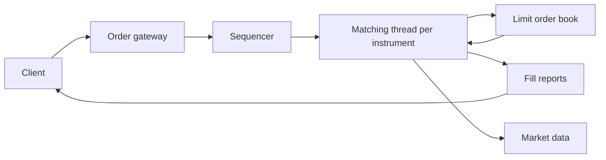

# About limit order books

A technical briefing for a software engineer who does not work in finance. This document explains the domain, the data structures, the matching loop, and the systems around them. It is an explanation, not a tutorial or an implementation spec.

This repository is empty besides git. The notes below are the research that would precede writing an engine.

## Overview

A limit order book is the in-memory state of one traded instrument on an electronic exchange. It stores every unmatched buy and sell order that is still live. A matching engine is the program that mutates that state. When a new order arrives, the engine either trades it against orders already in the book, parks the leftover in the book, or both.

The book exists because two people rarely want the same quantity at the same instant. Someone has to wait. The waiting side posts a price and a size and sits in a queue. The impatient side hits those resting orders and pays whatever prices they posted.

Nasdaq describes this in the [OUCH 5.0 spec](https://www.nasdaqtrader.com/content/technicalsupport/specifications/TradingProducts/OUCH5.0.pdf). The exchange accepts limit orders, matches them when it can, and otherwise adds them to "a database of available limit orders, where they wait to be matched in price time priority." Gould, Porter, Williams, McDonald, Fenn, and Howison surveyed the same mechanism across more than half of the world's markets in [Limit order books](https://arxiv.org/abs/1012.0349) (*Quantitative Finance*, 2013).

If you build software here, you are implementing a deterministic state machine. Inputs are order events (add, cancel, replace). Outputs are trades and a new book. Same event sequence, same trades, same book. That determinism is the whole product.

## Key concepts

**Instrument.** One book per stock, future, or other contract. `AAPL` and `MSFT` do not share a book. A production matcher usually shards by instrument and runs each shard on one thread, because matching needs a total order of events.

**Order.** An instruction with at least an id, a side (buy or sell), a quantity, and usually a limit price. Gould writes an order as `(price, size, time)`. His size is signed. Negative means buy. Use an enum and an unsigned quantity in code. Size is a multiple of a **lot size**. Price is a multiple of a **tick size**. Tick size is why you store prices as integers, never as `double`. Nasdaq ITCH encodes price as an integer with four implied decimal places. A tick of `$0.01` means `$101.50` is the integer `10150` if you work in cents, or `101500000` if you keep Nasdaq's four-decimal encoding.

**Limit order.** Buy at this price or lower. Sell at this price or higher. If the book cannot fill it now, the remainder rests. That is the default object in the book.

**Market order.** Fill now at whatever prices are available on the other side. No price protection. If the book is thin, a large market buy walks up through many ask levels and the average fill is worse than the best ask you saw a millisecond ago. Market orders do not rest.

**Marketable limit.** A limit order whose price already crosses the other side. A buy limited at `101` when the best ask is `100.50` is marketable. It trades immediately, then any leftover rests at `101` unless time-in-force says otherwise. Academic papers often call any immediately matching order a "market order" even if the trader sent a limit. The exchange protocol distinguishes them. Your types should too.

**Bid and ask.** Bids are resting buys, sorted best (highest price) first. Asks are resting sells, sorted best (lowest price) first. The **best bid** is the highest buy still in the book. The **best ask** is the lowest sell still in the book. Together they are the **top of book**, often called BBO (best bid and offer).

**Spread.** `best_ask - best_bid`. On a liquid US stock this is often one tick. The spread is the cost of trading now instead of waiting. A healthy continuous book is never crossed: `best_bid < best_ask`. If it stays crossed, you have a bug.

**Mid price.** `(best_bid + best_ask) / 2`. Derived state. Do not store it as source of truth.

**Resting vs aggressive.** A resting order sits in the book (maker). An incoming order that trades against it is the aggressor (taker). The trade price is the resting order's price, not the aggressor's limit. Gould is explicit about this. A buy limited at `101` that hits a sell resting at `100.50` trades at `100.50`. The buyer got a better price than they offered. That surprises people.

**Price-time priority (FIFO).** Best price first. At the same price, earliest arrival first. This is the default on Nasdaq equities and on CME products configured as FIFO. Time priority is why people colocate servers next to the matching engine. Being first in a queue is a property of arrival at the matcher, not of when the human clicked. NYSE is the US equity exception. It uses a [parity and priority](https://www.nyse.com/article/parity-priority-explainer) allocation at a price, not a pure FIFO queue. Implement FIFO first. Treat NYSE as a later special case.

**Pro-rata.** At the same price, allocate the incoming size in proportion to each resting order's size, then dump leftover lots FIFO because integer rounding does not divide evenly. CME Globex documents this family in [Supported Matching Algorithms](https://www.cmegroup.com/confluence/display/EPICSANDBOX/Supported+Matching+Algorithms). Databento's [August 2025 cheat sheet](https://databento.com/blog/cme-matching-algorithms-explained) puts FIFO at about 70% of CME volume (ES, NQ, CL, and similar). Configurable split FIFO and pro-rata, plus threshold pro-rata, cover most of the rest. Equities tutorials assume FIFO. That is correct for Nasdaq. It is not the universe.

**Time in force.**

- GTC (good till cancel): remainder rests until filled, canceled, or the venue kills it. "Until cancel" is not portable. CME GTC dies when the instrument expires. Nasdaq equities GTC was a one-year cap and is being removed. Do not copy FIX tag 59 into your types and assume every venue means the same thing.
- Day or GFD: remainder rests, then the venue cancels it at the session close.
- IOC (immediate or cancel): fill what you can now, kill the rest. Nothing rests. CME calls the same idea FAK (fill and kill).
- FOK (fill or kill): fill the entire quantity now, or do nothing. You must probe available size *before* mutating the book. You cannot fill three lots and then undo. All-or-none (AON) is different. AON may rest until the whole size can fill. FOK never rests.

**Post-only.** Reject the order if it would trade on arrival. Market makers use this to guarantee they are the maker.

**Stop orders.** Not in the limit book. They sit in a separate trigger table keyed by trigger price. When last trade (or best bid, depending on the venue) crosses the trigger, they convert into a market or limit order and then follow those rules. Mixing stop orders into the same sorted map as limits is a common first-draft mistake.

**Iceberg or hidden.** Only part of the size is displayed. Nasdaq ranks displayed orders at a price ahead of hidden ones. CME FIFO refreshes iceberg display after a fill and sends the order to the *back* of that level's queue. The public ITCH feed has no Add for hidden size. Hidden executions go out as Trade (`P`) and do not update the displayed book. A reconstructed public book is therefore not identical to the engine's book.

**Maker and taker fees.** Not part of matching. After the trade, the venue bills the taker and often rebates the maker. Your matching loop should not know about fees.

**L1, L2, L3 data.** L1 is top of book (one bid, one ask, last trade). L2 is aggregated size per price, often top N levels (market by price). L3 is every individual order (market by order). Databento's names are MBP-1, MBP-10, and MBO. You cannot recover queue position from L2. You can from L3.

## How it works

### The data shape

The domain is two layers, not a single heap of orders.

1. **Price levels**, sorted. Bids descending, asks ascending. Each level has a price and a total quantity.
2. **Orders inside a level**, in arrival order. A FIFO queue. Partial fills reduce quantity in place and keep the order's place in line.

A third index sits beside the book: `order_id -> (side, price, node or iterator)`. Cancels arrive by id, not by price. Without this map, cancel is a scan.

```
bids (high → low)              asks (low → high)
─────────────────              ─────────────────
101.00  [Dave 10]              101.50  [Alice 50] → [Bob 30]
100.50  [Eve 40] → [Frank 20]  102.00  [Carol 100]
100.00  [Gina 80]
```

Best bid is `101.00`. Best ask is `101.50`. Spread is `0.50`.

A single priority queue of all orders cannot do this cheaply. Price-time is a *lexicographic* order, but cancel-by-id and "walk consecutive prices" are the operations that matter. The two-layer structure matches those operations. WK Selph's 2011 note [How to Build a Fast Limit Order Book](https://gist.github.com/abhishekgahlot/ce154d9a1d0cca9b80d44b3705bcd987) is the canonical writeup of this layout. Tree of price levels, doubly linked FIFO at each price, hash map by order id, cached best bid and best ask. Gould's survey treats the book as a set of per-price queues for the same reason.

### A numeric example

Start with this book. Quantities are shares. Prices are dollars. FIFO within each level, oldest on the left.

| Bid qty | Bid price | Ask price | Ask qty |
| ------: | --------: | --------: | ------: |
|      40 |    100.50 |    101.00 |  50 then 30 |
|      80 |    100.00 |    101.50 |     100 |

The 50 at `101.00` arrived before the 30.

**Event 1.** Incoming buy, limit `101.00`, quantity `70`.

The buy price is greater than or equal to the best ask, so it crosses.

1. Trade `50` against the oldest ask at `101.00`. That order is gone. Trade price is `101.00`.
2. Trade `20` against the next ask at `101.00`. That order has `10` left and keeps its time priority. Trade price is still `101.00`.
3. Incoming quantity is now `0`. Stop. Nothing rests.

Book after event 1:

| Bid qty | Bid price | Ask price | Ask qty |
| ------: | --------: | --------: | ------: |
|      40 |    100.50 |    101.00 |      10 |
|      80 |    100.00 |    101.50 |     100 |

**Event 2.** Incoming buy, limit `101.50`, quantity `200`.

1. Trade `10` at `101.00` (only size left at that level). Level empties. Delete it.
2. Next ask is `101.50`, which is still within the limit. Trade `100` at `101.50`. Level empties.
3. No more asks at or below `101.50`. Remainder `90` rests on the bid side at `101.50`.

Book after event 2:

| Bid qty | Bid price | Ask price | Ask qty |
| ------: | --------: | --------: | ------: |
|      90 |    101.50 |    none |    none |
|      40 |    100.50 |         |         |
|      80 |    100.00 |         |         |

The book is one-sided. The next sell of any price at or below `101.50` will hit that new bid. Average fill for the `200` buy was `(10 * 101.00 + 100 * 101.50) / 110 ≈ 101.45` for the filled part. The unfilled `90` did not trade. That is market impact. The order walked the book.

**Event 3.** Cancel the `40` bid at `100.50` by order id.

Hash lookup, unlink from the FIFO at `100.50`, drop the empty level. Best bid is still `101.50`.

### The matching loop

For an incoming buy limit at price `P` with remaining quantity `Q` (the sell case is symmetric):

1. While `Q > 0` and there is a best ask `A` with `A <= P`:
   - Fill against the head of that level's FIFO, `fill = min(Q, head.qty)`.
   - Emit a trade at price `A` (resting price), size `fill`.
   - Decrease both quantities.
   - If the resting order hits zero, unlink it and free it.
   - If the level hits zero, delete the level and advance best ask.
2. If `Q > 0` and time-in-force allows resting, append the remainder to the bid FIFO at `P`. Create the level if needed.
3. If time-in-force is IOC, discard `Q`. If it is FOK, you never entered step 1 unless a dry-run said the whole `Q` was available.

FOK is the one case that reads the book without writing, then either commits or bails. Everything else is a single forward pass.

### Modify and replace

Venues treat "make this order smaller" differently from "change its price or make it larger."

- Quantity down, same price: update the field. Time priority stays. OUCH has a dedicated Modify. CME FIFO says an order loses priority if you increase quantity, change price, or change account.
- Reprice or quantity up: modeled as cancel plus new order. New time priority. Nasdaq OUCH Replace is this path. A replace that would cross is a new aggressive order, not a silent rest.

Market makers send cancel-replace far more often than new orders. The rymnc writeup notes that on a typical equity exchange, cancel-replace volume can be an order of magnitude above new-order volume. Make cancel fast.

### Continuous trading vs auctions

The loop above is **continuous trading**. Many equity venues freeze it at the open and the close and run a **call auction** instead. During the auction, bids may sit above asks. Nothing trades. At the uncrossing, the engine picks one price that maximizes matched volume (Gould §3.9, LSE SETS). Every fill at that instant is at the same price. Then continuous trading starts and the no-cross invariant returns.

If you only implement continuous trading, you still need to know auctions exist. Open and close prints in real data are not produced by the FIFO loop.

### Two programs that both look like a "book"

They are not the same binary.

**Matching engine.** Authoritative. Takes OUCH (Nasdaq) or FIX or a proprietary binary. Mutates the book. Emits fills back to the sender and market-data events to everyone. This is what you would write in this repo if the goal is an exchange.

**Book replica.** Read-only reconstruction from a public feed such as [Nasdaq TotalView-ITCH 5.0](https://www.nasdaqtrader.com/content/technicalsupport/specifications/dataproducts/NQTVITCHSpecification.pdf). Messages are Add, Execute, Cancel, Delete, Replace. You apply them in sequence number order and you get a copy of the *displayed* book. Hidden executions arrive as Trade (`P`). Ignore those when you only want the displayed book. There is no order id to update. Databento's [limit order book example](https://databento.com/docs/examples/order-book/limit-order-book) is this program: `order_id` map plus sorted price levels plus FIFO lists, driven by MBO actions.

ITCH is outbound only. OUCH is inbound plus your own fills. [SoupBinTCP](https://www.nasdaqtrader.com/content/technicalsupport/specifications/dataproducts/SoupBintcp.pdf) or [MoldUDP64](https://www.nasdaqtrader.com/content/technicalsupport/specifications/dataproducts/moldudp64.pdf) carry the bytes and the sequence numbers. Those transport sequences are not the same number as an OUCH order token or an ITCH order reference. GLIMPSE is a snapshot so you can join midday without replaying from midnight. Resume ITCH at the sequence in the snapshot message.

A replica cannot accept orders. An engine does not need to parse ITCH unless you are building a simulator that eats real tapes.



Martin Fowler's [LMAX Architecture](https://martinfowler.com/articles/lmax.html) is the canonical writeup of the surrounding shape. One in-memory business-logic thread. Input and output wired through a Disruptor ring buffer. No locks on the matching path. Event sourcing so you can replay. The [Disruptor paper](https://lmax-exchange.github.io/disruptor/files/Disruptor-1.0.pdf) is about that ring buffer, not about price levels. Do not confuse the queue between threads with the FIFO inside a price level.

### Textbook data structures vs later optimizations

A learning engine should look like this:

| Piece | Structure | Why |
| --- | --- | --- |
| Bid levels | ordered map, highest first (`std::map` with `greater`, Java `TreeMap` reversed, Rust `BTreeMap`) | iterate best to worst |
| Ask levels | ordered map, lowest first | same |
| Orders in a level | doubly linked list | O(1) append, O(1) unlink given a node |
| Id lookup | hash map to the list node | O(1) cancel |
| Price, qty, id | unsigned integers | exact compares |

Complexities, with `P` = number of occupied price levels and `K` = orders you fill on this event:

- Resting insert: `O(log P)` for the map, `O(1)` list append.
- Cancel: `O(1)` hash plus unlink. `O(log P)` extra if the level empties and you erase it from the map.
- Match: `O(K)` plus `O(log P)` per level you remove.
- Best bid or ask: `O(1)` if you cache the current best, otherwise `O(1)` from `map.begin()` on a tree that is ordered the right way.

That is enough. Selph wrote it in 2011. Later GitHub engines repeat it. [wooyoungcode/limit-order-book](https://github.com/wooyoungcode/limit-order-book) and [SLMolenaar/orderbook-simulator-cpp](https://github.com/SLMolenaar/orderbook-simulator-cpp) are readable C++ versions of the same three structures.

HFT engines then replace the tree because `log P` pointer chasing misses cache. Options:

- **Flat array indexed by tick.** Price `p` lives at `index = (p - base) / tick`. Best-price walk is sequential memory. Works when the live price range is bounded. The [rymnc Rust writeup](https://www.rymnc.com/posts/orderbook-for-modern-cpus/) uses 1024 levels per side and says recentering on a big move is unfinished. [m-koska/hft-orderbook](https://github.com/m-koska/hft-orderbook) uses a chess-style bitboard of occupied ticks plus a flat bucket array.
- **Intrusive lists and object pools.** Each `Order` carries `prev` and `next`. No heap allocation on the hot path. Orders are 64 or 128 bytes so one cache line holds one order.
- **Cached best pointers.** Only scan when the best level dies.

Do not start there. Start with the tree plus list plus hash map, integer prices, and tests of the numeric example above. Cache layout is a later measurement.

## Where things live

This repository has no engine yet. In a typical project the pieces land here:

| Concern | Lives in | Does not live in |
| --- | --- | --- |
| `Order`, `Side`, `Price`, `Qty` as integers | `types` | protocol code |
| Two-sided book, FIFO levels, id index | `order_book` | networking |
| Cross, fill, rest, IOC, FOK | `matching_engine` calling the book | the list node type |
| Stop triggers | separate `stop_book` | the limit book |
| OUCH or FIX decode | `gateway` | the matcher |
| ITCH encode or replica apply | `market_data` | the matcher |
| Persistence and replay | sequencer journal | the book itself |
| Fees, risk, accounts | after the trade | the matching loop |

The book should be a pure function of an event plus current state. Input and output stay outside. To test it, feed the three events from the numeric example and assert the trades and the remaining levels.

## Gotchas

**Floats.** `0.1 + 0.2` is not `0.3`. Price comparison is an invariant. Use integer ticks. Nasdaq and ITCH already do.

**A heap of orders is the wrong shape.** It gives you "next match" and fights you on cancel and on walking consecutive prices. Use levels plus FIFO plus an id index.

**`std::vector` as the FIFO.** Append is fine. Cancel of an arbitrary order is `O(n)` and shifts later orders, which is correct for FIFO but slow. `swap_remove` is `O(1)` and **breaks time priority**. The rymnc post does this and calls it out. Store a `std::list` iterator in the id map, not a `deque` or `vector` iterator. Later appends and erases invalidate those. List erase of one node leaves other iterators valid. Intrusive `prev` and `next` inside `Order` is the same idea with no extra node allocation.

**Gould's buy sign.** In the survey, `ωx < 0` is a buy. Most engines use `Side::Buy` plus an unsigned quantity. Copying the paper's signed size into production types will fail a code review for a good reason.

**Empty levels.** After the last order at a price fills or cancels, delete the level. Stale empty levels make "best ask" lie.

**Trade price is the resting price.** Assert this in tests. Incoming limit is a cap (buys) or a floor (sells), not the print.

**FOK cannot partially commit.** Dry-run first. Rolling back fills means you already notified someone.

**Quantity-down keeps priority. Reprice does not.** Mixing those in one `modify()` is how you fail a venue-conformance test.

**Hidden liquidity.** A public replica will not match an engine that supports icebergs. Know which program you are writing.

**Crossed book.** In continuous trading, if `best_bid >= best_ask` after an event, matching did not run far enough. During an auction it is legal. A locked or crossed *NBBO* across US venues is a different problem (Reg NMS 610). It is not a bug in one engine's book.

**Self-trade.** Some venues cancel one or both orders when the same firm would trade with itself. That rule sits in matching, not in the list.

**Clock.** FIFO time is matcher arrival sequence, not `gettimeofday`. LMAX and every serious engine sequence first, match second. Do not stamp orders inside the book with wall time and sort on it.

**One writer.** Two threads mutating one symbol's book will reorder events and break price-time. Shard by instrument. Hand events through a single-producer queue.

**Most events are cancels.** Selph's point in 2011 still holds. Adds and cancels dominate. Executions are a distant third. Optimize unlink. Matching a rare aggressive order can be slower.

**Lots of GitHub READMEs claim "production-grade nanosecond HFT."** Treat those as how-to-layout-a-struct tutorials. Exchange matching includes auctions, hidden orders, self-trade prevention, mass cancel, regulatory halts, and a sequenced journal. A laptop benchmark of insert and cancel is not that.

**Hobby engines that key `std::map<double, ...>`.** Useful to read once for the matching loop. Do not copy the `double`.

## What to build in this repo

If the goal is to learn, implement this and stop:

1. Integer `Price` and `Qty`.
2. Price-time book with tree levels, intrusive or `std::list` FIFO, hash id index.
3. Limit add, market add, cancel, quantity-down, reprice-as-cancel-replace.
4. IOC and FOK.
5. Trades emitted at resting price.
6. Tests for the numeric example, for empty-level deletion, for FOK not mutating on failure, and for a crossed incoming buy that rests a remainder.
7. Optional second binary. Replay a public ITCH sample into a replica and print top of book.

Skip pro-rata, icebergs, stops, and tick-indexed arrays until the FIFO engine is boringly correct.

## Helpful links

Ranked for a software reader. Every URL below was opened while writing this document.

### Start here

1. [Order (exchange)](https://en.wikipedia.org/wiki/Order_(exchange)) on Wikipedia covers limit vs market, IOC, FOK, GTC, stops, and icebergs. Read this before any code.
2. [Order book](https://en.wikipedia.org/wiki/Order_book) on Wikipedia covers price levels, top of book, spread, depth, and a crossed book.
3. [High Frequency Trading I](https://www.quantstart.com/articles/high-frequency-trading-i-introduction-to-market-microstructure/) on QuantStart is the first engineer-friendly walkthrough of limit vs market, partial fills, walking the book, and why thin books hurt. [Part II](https://www.quantstart.com/articles/high-frequency-trading-ii-limit-order-book/) defines spread, mid, and microprice. Strategy articles after that are a different topic.
4. [Nasdaq OUCH 5.0](https://www.nasdaqtrader.com/content/technicalsupport/specifications/TradingProducts/OUCH5.0.pdf) is the order-entry spec. The three sentences in §1 that define the book are the best official summary there is. Then skim Enter, Replace, Cancel, Executed. Prices are integers with four decimal places. Inbound messages are idempotent on retry.
5. [Nasdaq TotalView-ITCH 5.0](https://www.nasdaqtrader.com/content/technicalsupport/specifications/dataproducts/NQTVITCHSpecification.pdf) is the market-data spec. Add, Execute, Cancel, Delete, Replace. This is the event log a replica applies. Timestamps are nanoseconds since midnight. Stock locate is an integer index assigned daily. Hidden trades are message `P`. Do not apply them to the displayed book.

### Matching rules from venues

6. [CME Globex supported matching algorithms](https://www.cmegroup.com/confluence/display/EPICSANDBOX/Supported+Matching+Algorithms) documents FIFO, pro-rata, top order, and lead market maker. It shows that "the" matching algorithm is a product configuration, not a law of nature. Read the FIFO section and one pro-rata example.
7. [CME Globex matching algorithm steps](https://cmegroupclientsite.atlassian.net/wiki/spaces/EPICSANDBOX/pages/457218521/CME+Globex+Matching+Algorithm+Steps) lists the ordered stages (TOP, LMM, pro-rata, leveling, FIFO) and notes that pro-rata is never last because of rounding.
8. [CME matching algorithms explained](https://databento.com/blog/cme-matching-algorithms-explained) (Databento, August 2025) maps those letters onto products and share of CME volume. FIFO is about 70%. Use this after the official wiki, not instead of it.
9. [Nasdaq Rule 4757](https://www.sec.gov/files/rules/sro/nasdaq/2022/34-96069-ex5.pdf) is exchange rule text. Decrementation on fill. Price improvement accrues to the taker. Displayed size ranks ahead of hidden size at the same price.
10. [NYSE parity and priority](https://www.nyse.com/article/parity-priority-explainer) is the reminder that not every US equity venue is FIFO.
11. The [Xetra T7 market model](https://download.bse-sofia.bg/Xetra/T7/10.1/Functional/T7_Release_10.1_-_Market_Model-_Xetra.pdf) is Deutsche Börse's functional spec. Clean definitions of IOC, FOK, GTC, icebergs, and stop orders in an equity venue.

### Academic

12. [Gould et al., Limit order books, arXiv:1012.0349](https://arxiv.org/abs/1012.0349) is the survey to keep. Formal definitions of order, tick, lot, bid, ask, spread, mid. Matching at the resting price. Price-time vs pro-rata. Icebergs. Opening auctions. Empirical stylized facts. A free copy also sits at [UCLA](https://www.math.ucla.edu/~mason/papers/gould-qf-final.pdf).
13. [Cont, Stoikov, Talreja, A Stochastic Model for Order Book Dynamics](https://www.columbia.edu/~ww2040/orderbook.pdf) treats the book as queues on a tick grid. Useful once you have the matcher. It is a model of flow, not an implementation.
14. [Cont, Kukanov, Stoikov, The Price Impact of Order Book Events, arXiv:1011.6402](https://arxiv.org/abs/1011.6402) explains how adds, cancels, and trades at the best prices move the mid. Journal version: *Journal of Financial Econometrics* 12(1), 2014.
15. Larry Harris, *Trading and Exchanges*, Oxford University Press, 2003, chapter 4. Not free. Gould points here for venue-specific rules. The book is the standard practitioner text on order types.

### Systems around the book

16. [Martin Fowler, The LMAX Architecture](https://martinfowler.com/articles/lmax.html) describes a single-threaded in-memory matcher, disruptors in and out, and 6 million orders per second on one thread as of that writeup. The mental model for everything around the book.
17. The [LMAX Disruptor technical paper](https://lmax-exchange.github.io/disruptor/files/Disruptor-1.0.pdf) covers the ring buffer, single writer, and mechanical sympathy. Read after Fowler, not before. This is inter-thread messaging, not matching.
18. [SoupBinTCP 3.00](https://www.nasdaqtrader.com/content/technicalsupport/specifications/dataproducts/SoupBintcp.pdf) is the TCP session under OUCH and some ITCH. Host-to-client is sequenced and resumable. Client-to-host is not. That is why OUCH inbound messages must be safe to resend.
19. [MoldUDP64](https://www.nasdaqtrader.com/content/technicalsupport/specifications/dataproducts/moldudp64.pdf) is the UDP multicast under live ITCH. Gap detect, then unicast re-request. A gap means your replica is wrong until you recover.
20. [Nasdaq GLIMPSE 5.0](https://www.nasdaqtrader.com/content/technicalsupport/specifications/dataproducts/NQGlimpseSpecification_5.0.pdf) is the snapshot. Add every displayed order, then resume ITCH at the snapshot sequence.
21. [Databento: constructing the limit order book](https://databento.com/docs/examples/order-book/limit-order-book) applies MBO add, cancel, modify, and clear. `order_id` map plus sorted levels. Wait for the end-of-event flag before you read BBO. This is the replica, not the engine.
22. [Databento: market by order vs market by price](https://databento.com/docs/knowledge-base/new-users/fields-by-schema/mbo-mbo) names L3, L2, and L1.

### Implementation writeups worth reading

23. WK Selph, [How to Build a Fast Limit Order Book](https://gist.github.com/abhishekgahlot/ce154d9a1d0cca9b80d44b3705bcd987) (2011). Tree of limits, intrusive FIFO, id hash, cached inside. Add, cancel, execute complexities. This is the data-structure note to copy, not a GitHub README from 2025.
24. [i25959341/orderbook](https://github.com/i25959341/orderbook) is a small Go matcher with ASCII before-and-after books. Good first code read. It uses decimal prices. Copy the matching loop, not the `decimal` type.
25. [exchange-core](https://github.com/exchange-core/exchange-core) is a widely starred Java matcher on LMAX Disruptor, integer prices, GTC, IOC, FOK, and a journal. This implements matching. It does not parse ITCH.
26. [a sub-microsecond orderbook in rust](https://www.rymnc.com/posts/orderbook-for-modern-cpus/) covers why trees miss cache, integer ticks, object pools, and honest bugs (`swap_remove` vs FIFO, cloning the index vec while matching). Best "I measured it" post on this list.
27. [How I built an HFT matching engine (and all the things I got wrong)](https://dev.to/c0sbyy/how-i-built-an-hft-matching-engine-and-all-the-things-i-got-wrong-e23) writes down the usual first mistakes in order: `double` prices, `std::map` as the whole design, vector FIFO.
28. [wooyoungcode/limit-order-book](https://github.com/wooyoungcode/limit-order-book) is a C++20 sketch of the textbook layout: `std::map` of levels, Boost intrusive FIFO, slab pool, `unordered_map` of ids, 128-byte orders.
29. [SLMolenaar/orderbook-simulator-cpp](https://github.com/SLMolenaar/orderbook-simulator-cpp) uses the same shape, plus GTC, IOC, FOK, and good-for-day. Explains why the id map stores a list iterator. The Binance REST path is a display feed, not a venue matcher.
30. [m-koska/hft-orderbook](https://github.com/m-koska/hft-orderbook) uses tick-indexed buckets and a bitboard of live levels. Read after you understand the textbook book.
31. [LOBSTER](https://data.lobsterdata.com/info/docs/LobsterReport.pdf) (Huang and Polak, 2011) is how academics reconstruct Nasdaq books from ITCH. Order pool keyed by id. Apply Add, Execute, Delete. The live HTML docs on that host 500'd during this research. The PDF is the source.
32. [nkaz001/hftbacktest](https://github.com/nkaz001/hftbacktest) rebuilds L2 and L3 books and models queue position for backtests. A consumer of books, not an exchange.

### Skip or skim with suspicion

- Generic "become a quant" courses and SEO matching-engine listicles. They repeat price-time and then advertise a bootcamp.
- Interview-farm posts that invent latency numbers. The TreeMap plus FIFO story is right. The nanosecond claims are not a source of truth.
- Crypto exchange whitepapers that never state FIFO vs pro-rata, never define trade price, and never mention cancels.
- READMEs that lead with "nanosecond production HFT" and then allocate with `new` on every insert.
- Concurrent lock-free price-level crates as a first read. Matching one instrument is serial. Fowler and CME both assume that.
- The 2026 arXiv "World's Fastest Matching Engine" PIN paper. Interesting cache idea. Not how you should start, and the title is doing a lot of work.

## Sources used

Primary documents opened for this briefing:

- Gould et al., *Limit order books*, *Quantitative Finance* 13(11), 2013. [arXiv:1012.0349](https://arxiv.org/abs/1012.0349)
- Cont, Kukanov, Stoikov, *The Price Impact of Order Book Events*. [arXiv:1011.6402](https://arxiv.org/abs/1011.6402)
- Cont, Stoikov, Talreja, *A Stochastic Model for Order Book Dynamics* (author PDF)
- Nasdaq OUCH 5.0, October 2025
- Nasdaq TotalView-ITCH 5.0, SoupBinTCP, MoldUDP64, GLIMPSE 5.0
- Nasdaq Rule 4757 (SEC exhibit)
- CME Globex matching algorithm wiki pages
- Databento CME matching-algorithm volume mix, August 2025
- NYSE parity and priority explainer
- Xetra T7 market model 10.1
- Wikipedia *Order book* and *Order (exchange)*
- QuantStart HFT I and II
- WK Selph, *How to Build a Fast Limit Order Book*, 2011 (archived via gist)
- Fowler, *The LMAX Architecture*
- LMAX Disruptor 1.0 paper
- Databento MBO docs and order-book example
- rymnc, *a sub-microsecond orderbook in rust*
- LOBSTER technical report
- Open-source READMEs listed above

I did not run any of the GitHub engines. Complexity claims from READMEs are the authors' own unless they follow from the data structure (tree plus list plus hash is standard). Latency numbers from blog posts are single-machine anecdotes, not venue SLAs. Databento's CME volume mix is their published split, not an official CME statistic.
